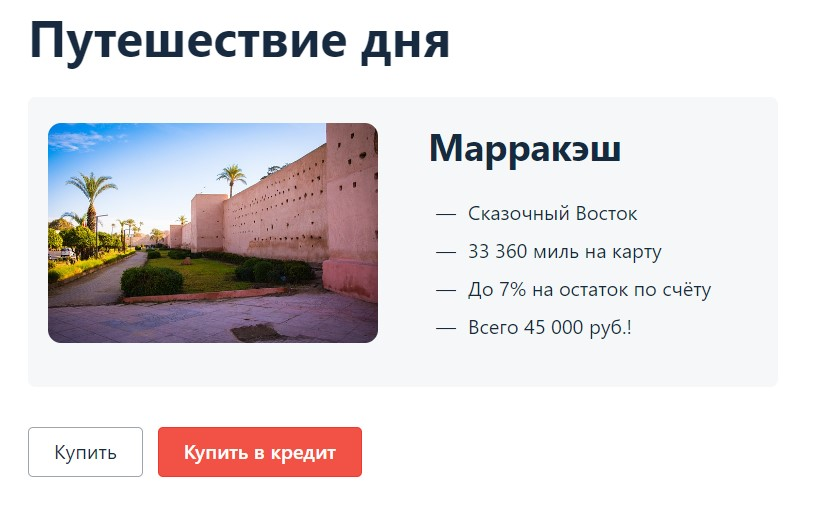
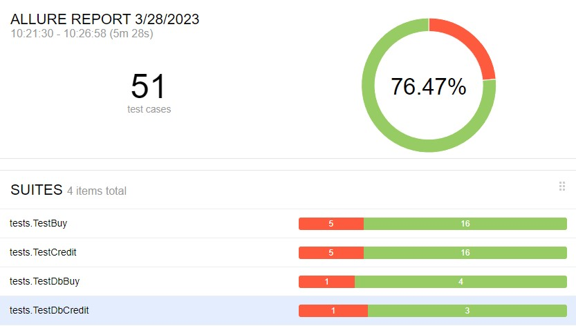

# Отчет по проведенному тестированию и рекомендации
***        
## **Краткое описание**
Проведеное комплексное тестирование сервиса оплаты путешествия банковской картой и в кредит. 
Проверено взаимодействия сервиса с API и БД MySQL, PostgreSQL. Сервис покрыт автотестами согласно ["плана автоматизации"](../document/Plan.md).

***         
## **Количество автоматизированных тестов, % успешных / не успешных**
Количество автоматизированных тестов 51.
76.47% успешных (39) / 23.53% (12) не успешных.
Заведено 7 issue на выявленные баги на основании автотестов.

***            
## **Общие рекомендации**
По итогам проведения тестирования сервиса можно сделать вывод, что сервис требует доработки. Перечень предложений представлен ниже:
### 1. Предложения по выявленным дефектам на стороне фронта:
* В хэдере страницы указано title "Заявка на карту". Исправить на "Путешествие дня"
* Орфографическая ошибка в названии города. Мараккэш пишется через букву "е".
* В описание тура указана, что Мараккеш город Востока. Город Марракеш находится в Морокко - Северная Африка.
### 2. Предложения по взаимодействию сервиса с API.
* В текущей версии сервис считает операцию успешной при использовании карты в статусе Declined. Является критическим багом.
### 3. Предложения по устранению дефектов при заполнении формы при оплате картой и в кредит.
* **Поле "Месяц"**: Проверить условия валидности поля. На текущий момент допускается месяц со значением "00".
* **Поле "Владелец"**: Проверить условия валидности поля. На текущий момент допускается владелец заполненный с  цифрами, кириллицей и спец.символами.
* **Поле "CVC/CVV"**: Проверить условия валидности поля.На текущий момент допускается CVV со значением "000".
### 4. Предложения по улучшению взаимодействия сервиса с СУБД:
* **Оплата картой**: Определить причины несоответствия стоимости тура со значением в поле amount таблицы payment_entity.
* **Оплата в кредит**: Определить причины несоответствия значений в поле credit_id таблицы order_entity, с полем bank_id 
таблицы credit_request_entity.   
